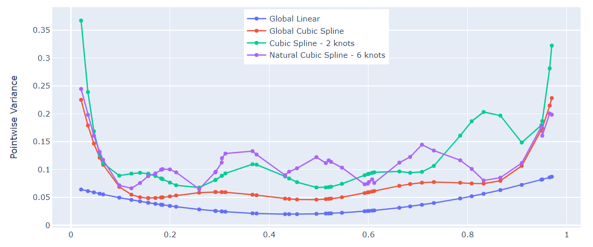

???+ question "Ex. 5.3"
    Write a program to reproduce Figure 5.3 on page 145.

??? done "Soln. 5.3" 
    Figure 1 is a reproduced version. We sample 50 points, $x_i$, uniformly from $[0,1]$ and let i.i.d. error terms $\epsilon_i\sim N(0, 0.01)$. The linear and cubic polynomial fits have two and four degrees of freedom, respectively, while the cubic spline and natural cubic spline each have six degrees of freedom. The cubic spline has two knots at 0.33 and 0.66, while the natural spline has boundary knots at 0.1 and 0.9, and four interior knots uniformly spaced between them.
	
	
    <center>*Figure 1: Pointwise Variance Curves for Four Different Models*</center>

??? example "Code"
    ```python
    import numpy as np
    from patsy import dmatrix
    import statsmodels.api as sm
    import plotly.graph_objects as go
    from numpy.linalg import inv

    # generate data
    np.random.seed(42)
    x = np.random.uniform(0, 1, 50)
    x = np.sort(x)
    err = np.random.normal(0, 1, 50)
    y = np.add(x, err)


    # linear regression
    def GLCov(x, sigma):
        x_m = np.array([np.ones(len(x)), x]).transpose()
        x_m_t = x_m.transpose()
        x_c = np.matmul(x_m_t, x_m)
        x_c_inv = inv(x_c)
        x_c_inv = x_c_inv * (sigma * sigma)
        return x_c_inv


    cov = GLCov(x, 1)
    pt_var = cov[0][0] + cov[1][1] * x * x + 2 * cov[0][1] * x

    # global cubic
    from numpy.linalg import inv
    from numpy.linalg import multi_dot


    def GlobalCubicCov(x, sigma):
        x_m = np.array([np.ones(len(x)), x, x * x, x * x * x]).transpose()
        x_m_t = x_m.transpose()
        x_c = np.matmul(x_m_t, x_m)
        x_c_inv = inv(x_c)
        x_c_inv = x_c_inv * (sigma * sigma)
        return x_c_inv


    x_square = x * x
    x_cubic = x * x * x
    m = GlobalCubicCov(x, 1)
    x_m = np.array([np.ones(len(x)), x, x * x, x * x * x]).transpose()
    res = multi_dot([x_m, m, x_m.transpose()])
    pt_var_cubic = res.diagonal()

    # Fit a cubic spline with two knots at 0.33 and 0.66
    x_cubic = dmatrix('bs(x, knots=(0.33, 0.66))', {'x': x})
    fit_cubic = sm.GLM(y, x_cubic).fit()

    # Fit a natural spline with lower and upper bounds
    x_natural = dmatrix('cr(x, df=6, lower_bound=0.1, upper_bound=0.9)', {'x': x})
    fit_natural = sm.GLM(y, x_natural).fit()

    # Create spline lines for 50 evenly spaced values of age
    # line_cubic = fit_cubic.predict(dmatrix('bs(xp, knots=(0.33, 0.66))', {'xp': x}))
    # line_natural = fit_natural.predict(dmatrix('cr(xp, df=6)', {'xp': x}))

    # natural cubic spline
    H = np.asarray(x_natural)
    sigma = 1
    m_Sigma = sigma * sigma * (inv(np.matmul(H.transpose(), H)))
    m_cubic_natural = multi_dot([H, m_Sigma, H.transpose()])
    res_cubic_natural = m_cubic_natural.diagonal()

    # cubic spline
    H = np.asarray(x_cubic)
    sigma = 1
    m_Sigma = sigma * sigma * (inv(np.matmul(H.transpose(), H)))
    m_cubic = multi_dot([H, m_Sigma, H.transpose()])
    res_cubic = m_cubic.diagonal()

    # Create traces
    fig = go.Figure()
    fig.add_trace(go.Scatter(x=x, y=pt_var,
                            mode='lines+markers',
                            name='Global Linear'))
    fig.add_trace(go.Scatter(x=x, y=pt_var_cubic,
                            mode='lines+markers',
                            name='Global Cubic Spline'))
    fig.add_trace(go.Scatter(x=x, y=res_cubic,
                            mode='lines+markers', name='Cubic Spline - 2 knots'))
    fig.add_trace(go.Scatter(x=x, y=res_cubic_natural,
                            mode='lines+markers', name='Natural Cubic Spline - 6 knots'))

    fig.update_layout(
        xaxis_title="x",
        yaxis_title="Pointwise Variance",
    )

    fig.update_layout(legend=dict(
        yanchor="top",
        y=0.99,
        xanchor="center",
        x=0.5
    ))
    fig.show()
    ```