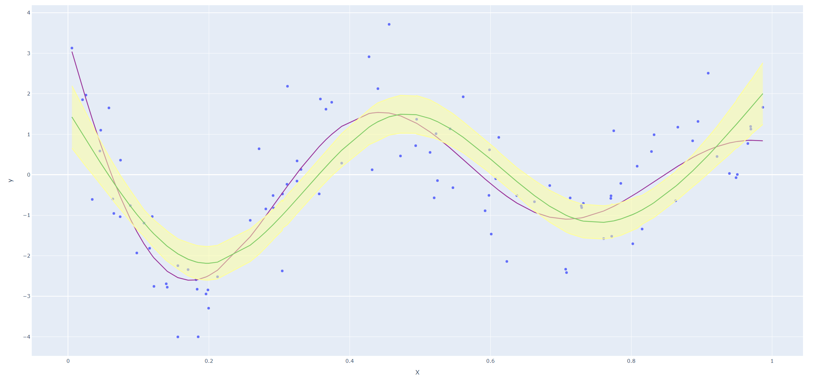
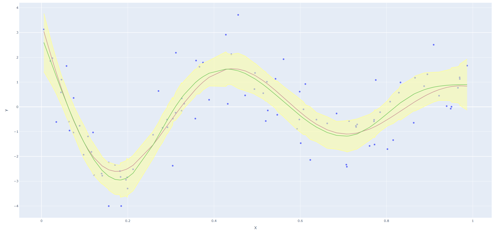

???+ question "Ex. 5.10"
    Derive an expression for $\text{Var}(\hat f_\lambda(x_0))$ and $\text{Bias}(\hat f_\lambda(x_0))$. Using the example (5.22), create a version of Figure 5.9 where the mean and several (pointwise) quantiles of $\hat f_\lambda(x)$ are shown.

??? done "Soln. 5.10"
    Since 

	\begin{equation}
		\hat{\mathbf{f}} = \bb{N}(\bb{N}^T\bb{N} + \lambda \bm{\Omega}_N)^{-1}\bb{N}^T\by\non
	\end{equation}
	
    we have
	
    \begin{equation}
		\hat f_\lambda(x_0) = \bb{N}(x_0)^T(\bb{N}^T\bb{N} + \lambda \bm{\Omega}_N)^{-1}\bb{N}^T\by\non
	\end{equation}
	
    where $\bb{N}(x_0) = (N_1(x_0), ..., N_N(x_0))^T$. Therefore we have
	
    \begin{eqnarray}
	    \text{Var}(\hat f_\lambda(x_0)) &=& \bb{N}(x_0)^T(\bb{N}^T\bb{N} + \lambda \bm{\Omega}_N)^{-1}\bb{N}^T\text{Var}(\by)(\bb{N}^T\bb{N} + \lambda \bm{\Omega}_N)^{-1}\bb{N}(x_0)\non
	\end{eqnarray}
	
    and 
	
    \begin{eqnarray}
		\text{Bias}(\hat f_\lambda(x_0)) &=& f_\lambda(x_0) - E[\hat f_\lambda(x_0)]\non\\
		&=&f_\lambda(x_0) - \bb{N}(x_0)(\bb{N}^T\bb{N} + \lambda \bm{\Omega}_N)^{-1}\bb{N}^T\by.\non
	\end{eqnarray}

	Next we reproduce Figure 5.9 in the text. Since smoothing splines has an explicit, finite-dimensional, unique minimizer which is a natural cubic spline with knots at the unique values of the $x_i$, we could use codes for natural cubic splines (I haven't found a convenient package for smoothing splines in Python yet.) 

    
    <center>*Figure 1: df=5*</center>
	
    
    <center>*Figure 2: df=9*</center>
	
    
    <center>*Figure 3: df=15*</center>

??? example "Code"
    ```python
    import numpy as np
    from numpy.linalg import multi_dot
    import statsmodels.api as sm
    from patsy import dmatrix
    import plotly.graph_objects as go
    from numpy.linalg import inv


    np.random.seed(42)
    n = 100
    sigma = 1


    def f(x):
        return np.sin(12 * (x + 0.2)) / (x + 0.2)


    X = np.random.uniform(0, 1, n)
    X = np.sort(X)
    epsilon = np.random.normal(0, sigma, n)
    y_true = f(X)
    y_realized = y_true + epsilon

    df = 15

    x_nc = dmatrix('cr(x, df={})'.format(df), {'x': X}, return_type="dataframe")
    fit_natural = sm.GLM(y_realized, x_nc).fit()
    line_nc = fit_natural.predict(dmatrix('cr(xp, df={})'.format(df), {'xp': X}))

    H = np.asarray(x_nc)
    sigma = 1
    m_Sigma = sigma * sigma * (inv(np.matmul(H.transpose(), H)))
    m_nc = multi_dot([H, m_Sigma, H.transpose()])
    pt_var_nc = m_nc.diagonal()
    pt_std_nc = np.sqrt(pt_var_nc)
    upper = line_nc + 2 * pt_std_nc
    lower = line_nc - 2 * pt_std_nc

    # Create traces
    fig = go.Figure()
    fig.add_trace(go.Scatter(x=X, y=y_realized,
                            mode='markers',
                            name='Raw'))
    fig.add_trace(go.Scatter(x=X, y=y_true,
                            mode='lines',
                            name='True',
                            line_color='#993399'))
    fig.add_trace(go.Scatter(x=X, y=line_nc,
                            mode='lines',
                            name='Fitted', line_color='#009933'))
    fig.add_trace(go.Scatter(x=X, y=lower,
                            mode='lines',
                            name='Lower Limit', line_color='#ffff99'))
    fig.add_trace(go.Scatter(x=X, y=upper,
                            mode='lines',
                            name='Upper Limit', fill='tonexty', line_color='#ffff99'))
    fig.update_layout(
        xaxis_title="X",
        yaxis_title="y",
    )

    fig.show()
    ```
	