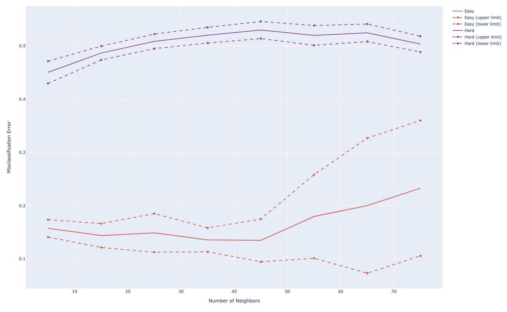

???+ question "Ex. 13.7"
    Consider the application of nearest-neighbors to the *easy* and *hard* problems in the left panel of Figure 13.5.

	(a) Replicate the results in the left panel of Figure 13.5.
	
    (b) Estimate the misclassification errors using fivefold cross-validation, and compare the error rate curves to those in 1.
	
    (c) Consider and ``AIC-like'' penalization of the training set misclassification error. Specifically, add $2t/N$ to the training set misclassification error, where $t$ is the approximate number of parameters $N/r$, $r$ being the number of nearest-neighbors. Compare plots of the resulting penalized misclassification error to those in 1 and 2. Which method gives a better estimate of the optimal number of nearest-neighbors: cross-validation or AIC?

??? done "Soln. 13.7"
	(a) Please see Figure 1 for a replicate of left panel of Figure 13.5 in the text. 
   
	
    <center>*Figure 1: Replicate of Figure 13.5*</center>

	(b) and (c) Please see Figure 2 for comparison of estimated error rates using cross validation and those from 1. When the number of neighbor $r$ is small, the AIC penalty $2/r$ is large, so that AIC estimate is much greater than estimates from other two methods. In our simulation, cross-validation gives a better estimate.

	
    <center>*Estimated Error Rates Using CV and AIC-like Penalty*</center>    

??? example "Code"
    ```python
    import numpy as np
    from sklearn.neighbors import KNeighborsClassifier
    from sklearn.model_selection import cross_val_score
    import plotly.graph_objects as go


    # Prepare data
    def generateData(train_size=100, test_size=1000, p=10):
        X_train = np.random.uniform(0, 1, size=(train_size, p))
        X_test = np.random.uniform(0, 1, size=(test_size, p))
        y_train_easy = generateYEasy(X_train)
        y_train_hard = generateYHard(X_train)
        y_test_easy = generateYEasy(X_test)
        y_test_hard = generateYHard(X_test)

        data_easy = {
            'X_train': X_train,
            'y_train': y_train_easy,
            'X_test': X_test,
            'y_test': y_test_easy
        }

        data_hard = {
            'X_train': X_train,
            'y_train': y_train_hard,
            'X_test': X_test,
            'y_test': y_test_hard
        }

        return [data_easy, data_hard]


    def generateYEasy(X):
        y = X[:, 0].copy()
        y[y < 0.5] = 0
        y[y > 0.5] = 1
        return y


    def generateYHard(X):
        y = X[:, 0].copy()
        for i in range(X.shape[0]):
            prod = 1
            for j in range(3):
                prod *= (X[i, j] - 0.5)
            if prod > 0:
                y[i] = 1
            else:
                y[i] = 0
        return y


    # a utility function to calculate error rate
    # of predictions
    def getErrorRate(a, b):
        return np.sum(a != b) / a.size


    # 1. Replicate Figure 13.5
    def getErrorsKNN(num_neighbor=None, data=None):
        clf = KNeighborsClassifier(n_neighbors=num_neighbor)
        clf.fit(data['X_train'], data['y_train'])
        y_predict = clf.predict(data['X_test'])

        return getErrorRate(y_predict, data['y_test'])


    n_neighbors = np.arange(5, 80, 10)
    n_iterations = 10

    error_mean_easy_list = []
    error_std_easy_list = []
    error_mean_hard_list = []
    error_std_hard_list = []

    for n_neighbor in n_neighbors:
        print('Number of Neighbors is: {}'.format(n_neighbor))
        tmp_errs_easy = []
        tmp_errs_hard = []
        for n_ite in range(n_iterations):
            print('Running {}-th realization...'.format(n_ite+1))
            [data_easy, data_hard] = generateData()
            tmp_errs_easy.append(getErrorsKNN(n_neighbor, data_easy))
            tmp_errs_hard.append(getErrorsKNN(n_neighbor, data_hard))

        error_mean_easy_list.append(np.mean(np.asarray(tmp_errs_easy)))
        error_std_easy_list.append(np.std(np.asarray(tmp_errs_easy)))

        error_mean_hard_list.append(np.mean(np.asarray(tmp_errs_hard)))
        error_std_hard_list.append(np.std(np.asarray(tmp_errs_hard)))


    # Create traces
    fig = go.Figure()
    easy_color = '#eb4034'
    hard_color = '#993399'
    fig.add_trace(go.Scatter(x=n_neighbors, y=error_mean_easy_list,
                            mode='lines',
                            name='Easy',
                            line_color=easy_color
                            ))

    fig.add_trace(go.Scatter(x=n_neighbors, y=np.asarray(error_mean_easy_list)+np.asarray(error_std_easy_list),
                            mode='lines+markers', name='Easy (upper limit)',
                            line_color=easy_color, line={'dash': 'dash'}
                            ))

    fig.add_trace(go.Scatter(x=n_neighbors, y=np.asarray(error_mean_easy_list)-np.asarray(error_std_easy_list),
                            mode='lines+markers', name='Easy (lower limit)',
                            line_color=easy_color, line={'dash': 'dash'}
                            ))

    fig.add_trace(go.Scatter(x=n_neighbors, y=error_mean_hard_list,
                            mode='lines', name='Hard',
                            line_color=hard_color))

    fig.add_trace(go.Scatter(x=n_neighbors, y=np.asarray(error_mean_hard_list)+np.asarray(error_std_hard_list),
                            mode='lines+markers', name='Hard (upper limit)',
                            line_color=hard_color, line={'dash': 'dash'}
                            ))

    fig.add_trace(go.Scatter(x=n_neighbors, y=np.asarray(error_mean_hard_list)-np.asarray(error_std_hard_list),
                            mode='lines+markers', name='Hard (lower limit)',
                            line_color=hard_color, line={'dash': 'dash'}
                            ))

    fig.update_layout(
        xaxis_title="Number of Neighbors",
        yaxis_title="Misclassification Error",
    )

    fig.show()


    # 2 and 3, five-fold CV and AIC
    error_mean_easy_cv_list = []
    error_mean_hard_cv_list = []
    error_mean_easy_AIC_list = []
    error_mean_hard_AIC_list = []

    [data_easy, data_hard] = generateData()
    for n_neighbor in n_neighbors:
        print('CV=5, Number of Neighbors is: {}'.format(n_neighbor))
        clf = KNeighborsClassifier(n_neighbors=n_neighbor)
        scores_easy = cross_val_score(clf, data_easy['X_train'], data_easy['y_train'], scoring='accuracy', cv=5)
        scores_hard = cross_val_score(clf, data_hard['X_train'], data_hard['y_train'], scoring='accuracy', cv=5)
        error_mean_easy_cv_list.append(1 - np.mean(scores_easy))
        error_mean_easy_AIC_list.append(1 - np.mean(scores_easy) + 2/n_neighbor)
        error_mean_hard_cv_list.append(1 - np.mean(scores_hard))
        error_mean_hard_AIC_list.append(1 - np.mean(scores_hard) + 2/n_neighbor)

    fig.add_trace(go.Scatter(x=n_neighbors, y=error_mean_easy_cv_list,
                            mode='lines',
                            name='Easy_CV'
                            ))

    fig.add_trace(go.Scatter(x=n_neighbors, y=error_mean_easy_AIC_list,
                            mode='lines',
                            name='Easy_AIC'
                            ))

    fig.add_trace(go.Scatter(x=n_neighbors, y=error_mean_hard_cv_list,
                            mode='lines',
                            name='Hard_CV'
                            ))

    fig.add_trace(go.Scatter(x=n_neighbors, y=error_mean_hard_AIC_list,
                            mode='lines',
                            name='Hard_AIC'
                            ))

    fig.show()
    ```
