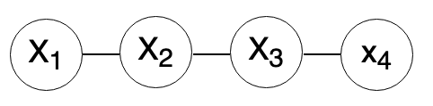

???+ question "Ex. 17.2"
	Consider random variables $X_1, X_2, X_3, X_4$. In each of the following cases draw a graph that has the given independence relations:
	
    (a) $X_1\bot X_3|X_2$ and $X_2\bot X_4|X_3$.
	
    (b) $X_1\bot X_4|X_2, X_3$ and $X_2\bot X_4|X_1, X_3$.
	
    (c) $X_1\bot X_4|X_2, X_3, X_1\bot X_3|X_2, X_4$ and $X_3\bot X_4|X_1, X_2$.
	
??? done "Soln. 17.2"
    (a) 	
    
    
    (b)

    

    (c)
    
    

