There is an errata page maintained in the [official site](https://web.stanford.edu/~hastie/ElemStatLearn/). Below is a list of potential erratum that I found during reading and not reflected in the official errata page yet. 

## Chapter 3
1. In Ex. 3.9 and Ex. 3.10, there two different forms of **residual sum-of-squares**.

    ???tldr "Text"
        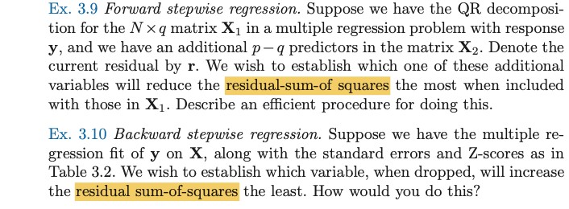

## Chapter 5

1. On page 160, the convention should be **Exercise 5.10** instead of **exercise (5.10)**.
   
    ???tldr "Text"
        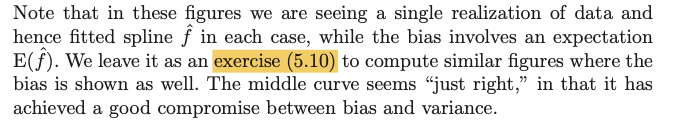

## Chapter 9

1. In [Ex. 9.3](9-Additive-Models-and-Trees/ex9-3.md), the matrix $S$ should be bold $\textbf{S}$.
   
    ???tldr "Text"
        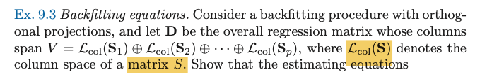

2. In [Ex. 9.6](9-Additive-Models-and-Trees/ex9-6.md), the period should be removed.

    ???tldr "Text"
        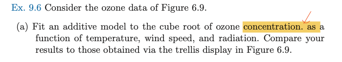

## Chapter 10 

1. On page 360, it should be **Exercise 10.10** instead of **exercise 10.10**.

    ???tldr "Text"
        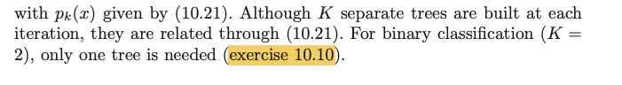

2. In [Ex. 10.8 (b)](_10-Boosting-and-Additive-Trees/ex10-08.md), the enum item should be **(a)** instead of **(1)**.
   
    ???tldr "Text"
           

3. In [Ex. 10.9](_10-Boosting-and-Additive-Trees/ex10-09.md), it should be **Exercise 10.8** instead of **exercise 10.8**. 
    
    ???tldr "Text"
        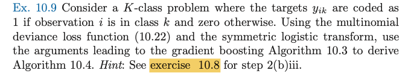   

## Chapter 11 

1. On page 396, equation (11.12), it should be $\sigma^{'}(\alpha_{0m} + \alpha_m^Tx_i)$, the term $\alpha_{0m}$ seems missing. Similarly in equation (11.15).

    ???tldr "Text"
        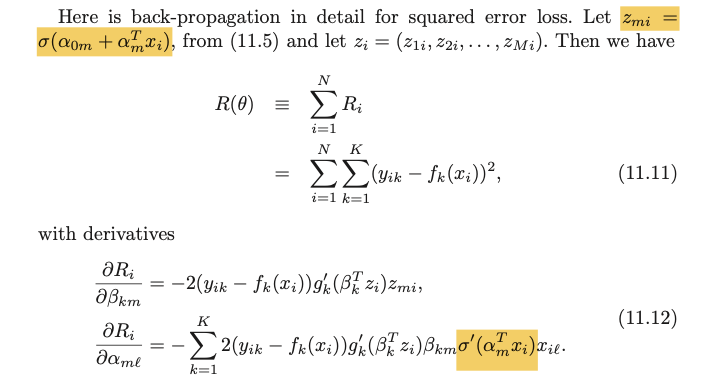  

2. In [Ex. 11.5](_11-Neural-Networks/ex11-5.md), it seems the transposes of $a_1$ and $a_2$ are $1\times 2$, i.e., **$a_1^T=(3,3)$**.

    ???tldr "Text"
        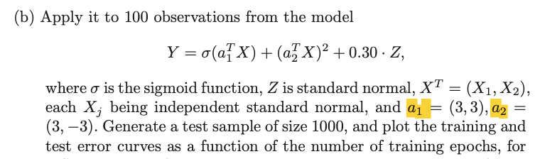

## Chapter 13

1. In [Ex. 13.3](_13-Prototypes-and-Nearest-Neighbors/ex13-3.md), it seems we need a comma instead of a period after the equation.

    ???tldr "Text"
        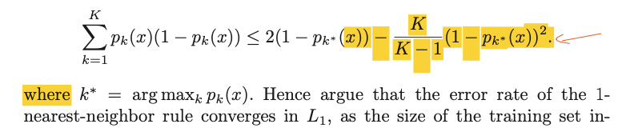

## Chapter 14

1. On page 540, equation (14.57), it should be $\hat{\textbf{R}}^T\bar x_1$. See [Solution 14.8](_14-Unsupervised-Learning/ex14-08.md) for derivation.

    ???tldr "Text"
        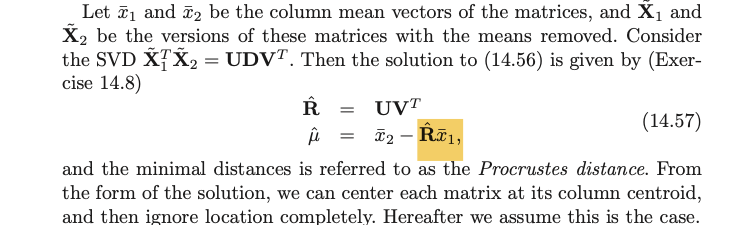

2. On page 540, right below equation (14.58), the formula for $\hat\beta$, the matrix $D$ should be bold $\bb{D}$.

    ???tldr "Text"
        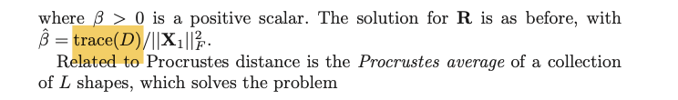

3. In [Ex. 14.2](_14-Unsupervised-Learning/ex14-02.md), I guess the reference to EM algorithm is **Algorithm 8.1** in **Section 8.5**, instead of **Section 8.1**.

    ???tldr "Text"
        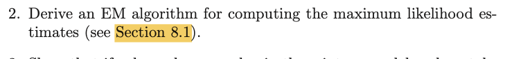

4. In Ex. 14.11, I guess it's the transposes of $z_i$, i.e., $z_i^T$ are the *rows*.

    ???tldr "Text"
        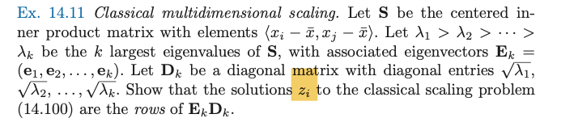

## Chapter 15
1. In [Ex. 15.4](_15-Random-Forests/ex15-4.md), $x_i$ are assumed to be iid **normal**: $N(\mu, \sigma^2)$.

    ???tldr "Text"
        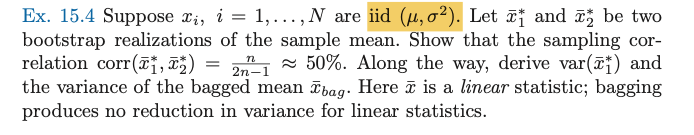

## Chapter 16
1. In [Ex. 16.2](_16-Ensemble-Learning/ex16-2.md), the argument in the integrand should be something other than $t$? For example, $\Lambda(t) = \int_0^t|\dot{\alpha}(s)|ds$. 
   
    ???tldr "Text"
        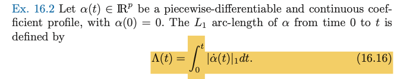

## Chapter 17
1. On page 639, right above equation (17.30), it should be **Exercise 17.11**.
    
    ???tldr "Text"
        

2. At the end of [Ex. 17.3](_17-Undirected-Graphical-Models/ex17-03.md), a period is missing.

    ???tldr "Text"
        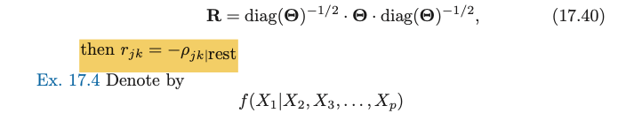

## Chapter 18
1. On page 659, between equations (18.13) and (18.14), it should be $d_1\ge d_2 \ge \cdots \ge d_N\ge 0$.

    ???tldr "Text"
        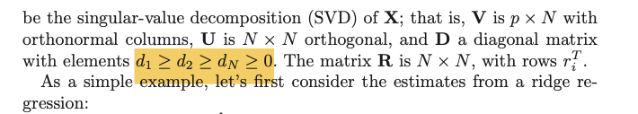

2. In [Ex. 18.16](_18-High-Dimensional-Problems/ex18-16.md), the index should be $\textbf{j}$.

    ???tldr "Text"
        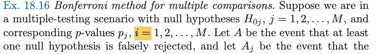

3. In [Ex. 18.18](_18-High-Dimensional-Problems/ex18-18.md), it's more understandable if we make the dependence of pFDR on $\Gamma$ more explicit by $\text{pFDR}(\Gamma)$ on the left hand side of the equation. Second, a multiplication dot is missing between $\pi_1$ and the bracket term.
   
    ???tldr "Text"
        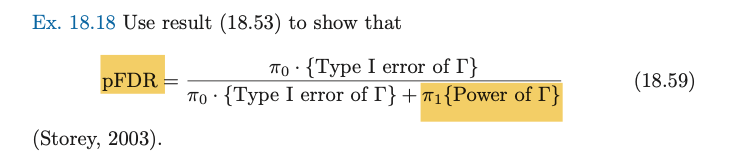

4. In [Ex. 20](_18-High-Dimensional-Problems/ex18-20.md), the literature *Storey, 2002* used notation $P(H=0|T\in \Gamma)$, however in the textbook, I believe the correct notation should be $P(Z=0|T\in \Gamma)$ used in Section 18.7.3.

    ???tldr "Text"
        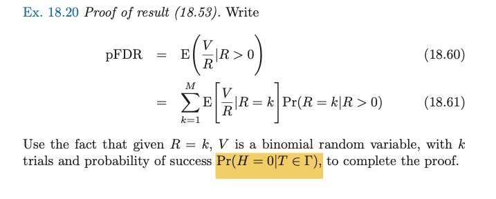